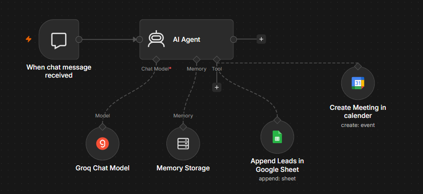

# Cacao Co. Customer Service Chatbot

An n8n workflow that powers a public website chat assistant ("Jarvis")
for a cocoa merchant. It answers product questions, captures leads, and
books Google Meet calls.

## Features
- Chat widget via n8n's Chat Trigger (public)
- Answers only from a defined business fact sheet
- Collects name, phone and email at the start of each conversation
- Saves leads to Google Sheets, tagged "Serious Lead" or "Unserious Lead"
- Books 30-minute Google Meet calls, Mon-Fri, 9am-5pm WAT
- Rolling 14-day date list injected into the prompt to avoid date errors

## Stack
| Part | Tool |
|------|------|
| Orchestration | n8n |
| LLM | Groq (openai/gpt-oss-120b) |
| Memory | Simple Memory (10-message window) |
| Calendar | Google Calendar (with Meet) |
| Lead storage | Google Sheets |

## Setup
1. In n8n, go to Workflows > Import from File and select `workflow.json`.
2. Reconnect credentials: Groq, Google Calendar OAuth2, Google Sheets OAuth2.
3. Point the Calendar node at your calendar.
4. Create a Google Sheet with a `Leads` tab and columns:
   `Date | Name | Phone | Email | Enquiry | Category`
   then select it in the `append_leads` node.
5. Activate the workflow and embed or share the chat URL.

## Notes
- Timezone is set to Africa/Lagos in the prompt and sheet date.
- The business facts live in the AI Agent's system message; edit them there.
